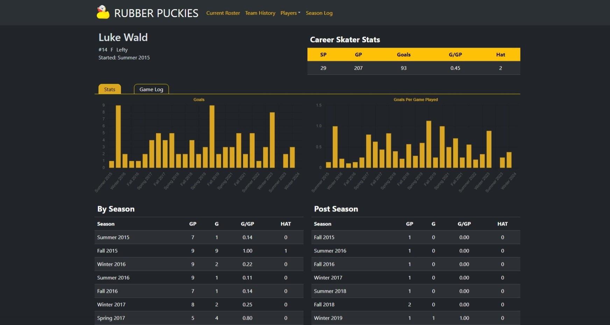
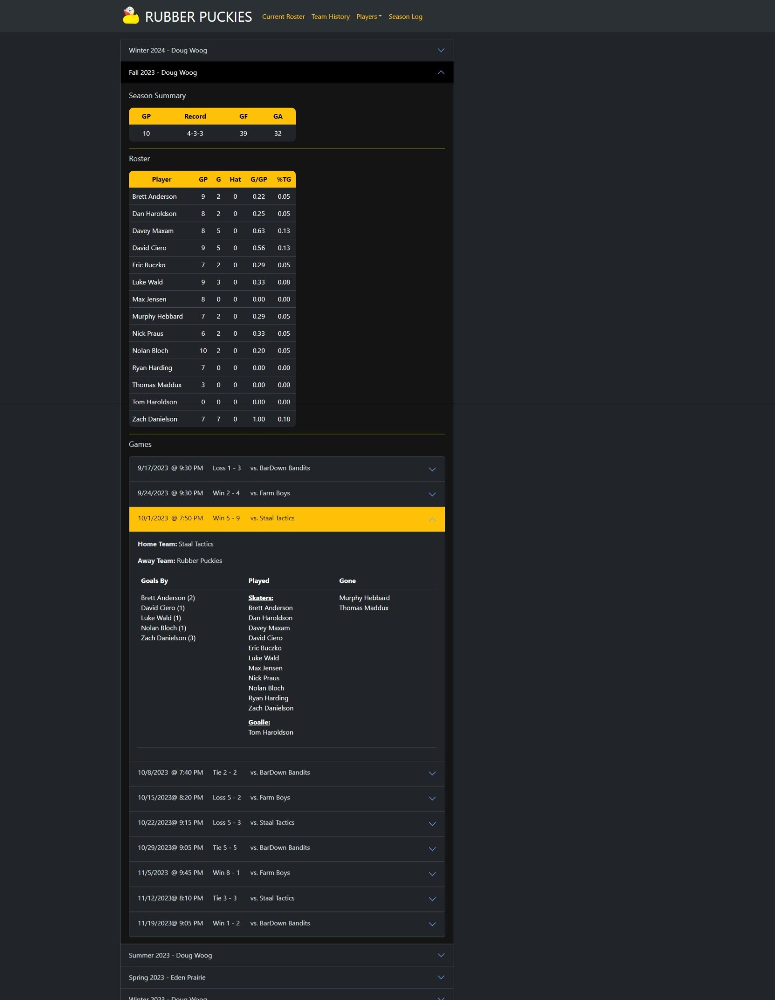

# Rubber Puckies Web App

## Description
This is a MERN stack web application that displays the stats of the infamous Rubber Puckies hockey team. The user can look up the current roster stats, stats for each individual player, as well as viewing the historical log of all seasons and games played by the team.

In addition, this web app features an admin only view for adding, updating, and deleteing Seasons, Teams, Players, and Games. These admin tools will dynamically update the web app and database.

## Table of Contents
- [Website Links](#website-links)
- [Technical Requirements](#technical-requirements)
- [Questions](#questions)
- [Acknowledgements and Credits](#acknowledgements-and-credits)
- [Preview](#preview)

## Website Links
- [Deployed App Through Heroku](https://rubberpuckies-0b6fa405e1f5.herokuapp.com/roster)
- [GitHub Repo](https://github.com/wald14)

## Technical Requirements

Technical requirements for the application include:

- React
- Mongoose ORM
- MongoDB
- Express.js
- Node.js
- Heroku
- Bootstrap
- chart.js
- Bcrypt
- dotenv
- cookie-parser
- jsonwebtoken
- Insomnia
- MVC Structure
- Github
- Vite

## Questions
Questions can be received on the [Github Repository](https://github.com/wald14) for this application. Please make a new issue.

## Acknowledgements and Credits
Starter code for generic login/logout functionality was provided by Gary Almes' [mern-auth-starter-kit](https://github.com/garytalmes/mern-auth-starter-kit). This was modified to be used for admin login and not avaliable to the general user.

## Preview
The following images share the application's apperance for both the typical user and admin view:

### Front Page

### Admin Page

### Admin Tools - Update Player 

### Current Roster Page

### Team History Page

### Individual Player Pages

### Season Log Page
