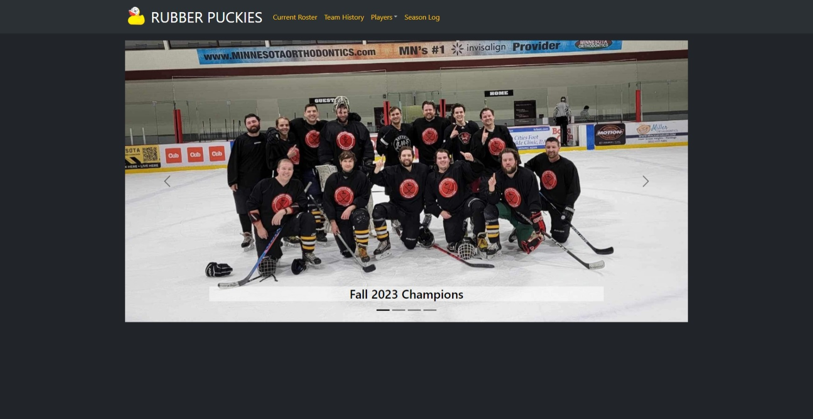

# Rubber Puckies Web App

## Description
Every wanted to see stats on infamous Rubber Puckies hockey team? Are you curious if a certain player scores more in the Home jersey vs the Away? Well this application delivers those stats to you! 

The user can:
 - Look up the current roster, 
 - See stats for each individual player
    - Stats: Shows graphs of the user's goals and goals/game played per season. Also showes a table with these results from the regular and playoff seasons.
    - Splits: Shows the user's stats based off four different splts. Home vs Away, Season Type, the games Start Hour, and Opponent.
    - Game Log: Shows all the games that the player was on the roster for. The user can see if the player played and how many goals they scored.
 
 , and view the historical log of all seasons and games played by the team. The individual player stats are broken down into 3 tabs: Stats, Splits, and Game Log. 

In addition, this web app features an admin only view for adding, updating, and deleteing Seasons, Teams, Players, and Games. These admin tools will dynamically update the web app and database.

## Table of Contents
- [Website Links](#website-links)
- [Technical Requirements](#technical-requirements)
- [Questions](#questions)
- [Acknowledgements and Credits](#acknowledgements-and-credits)
- [Preview](#preview)

## Website Links
- [Deployed App Through Heroku](https://rubberpuckies-0b6fa405e1f5.herokuapp.com/roster)
- [GitHub Repo](https://github.com/wald14)

## Technical Requirements

Technical requirements for the application include:

- React
- Mongoose ORM
- MongoDB
- Express.js
- Node.js
- Heroku
- Bootstrap
- chart.js
- Bcrypt
- dotenv
- cookie-parser
- jsonwebtoken
- Insomnia
- MVC Structure
- Github
- Vite

## Questions
Questions can be received on the [Github Repository](https://github.com/wald14) for this application. Please make a new issue.

## Acknowledgements and Credits
Starter code for generic login/logout functionality was provided by Gary Almes' [mern-auth-starter-kit](https://github.com/garytalmes/mern-auth-starter-kit). This was modified to be used for admin login and not avaliable to the general user.

## Preview
The following images share the application's apperance for both the typical user and admin view:

### Front Page

### Current Roster Page

### Team History Page

### Individual Player Pages (Stats Tab)

### Individual Player Pages (Splits Tab)

### Season Log Page

### Admin Login

### Admin Page

### Admin Tools - Update Player 

